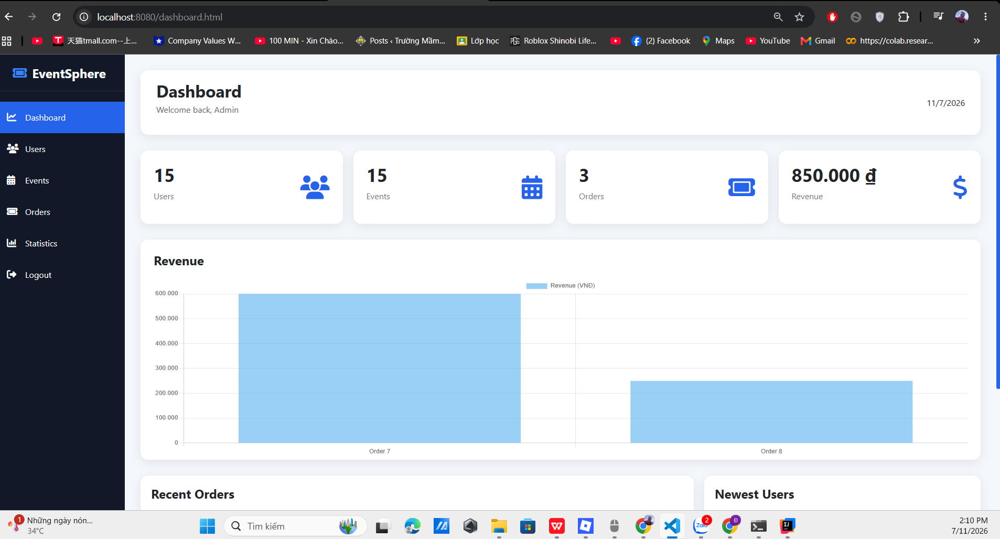

# SonarQube Report

## Mục đích

SonarQube được sử dụng để kiểm tra chất lượng mã nguồn của dự án EventSphere.

---

# Các tiêu chí đánh giá

- Bugs
- Vulnerabilities
- Code Smells
- Security Hotspots
- Reliability
- Maintainability
- Duplicated Code
- Coverage

---

# SonarQube Dashboard

Dự án được kiểm tra chất lượng mã nguồn bằng SonarQube thông qua IntelliJ IDEA.

Ảnh Dashboard được lưu trong thư mục:

images/sonarqube-dashboard.png

Ví dụ:

```md

```
Repository

README.md
README_API.md
README_PROCESS.md
README_SONARQUBE.md

images
    ├── dashboard.png(images/sonarqube-dashboard.png)
    ├── users.png(E:\DatVe\images\user.png)
    ├── events.png(E:\DatVe\images\events.png)
    ├── orders.png(E:\DatVe\images\order.png)
    ├── statistics.png(E:\DatVe\images\statistics.png)
    └── sonarqube-dashboard.png(images/sonarqube-dashboard.png)
```

---

# Kết quả mong muốn

Sau khi chạy SonarQube, Dashboard sẽ hiển thị:

- Quality Gate
- Bugs
- Vulnerabilities
- Code Smells
- Coverage
- Duplicated Lines
- Maintainability Rating
- Reliability Rating
- Security Rating
